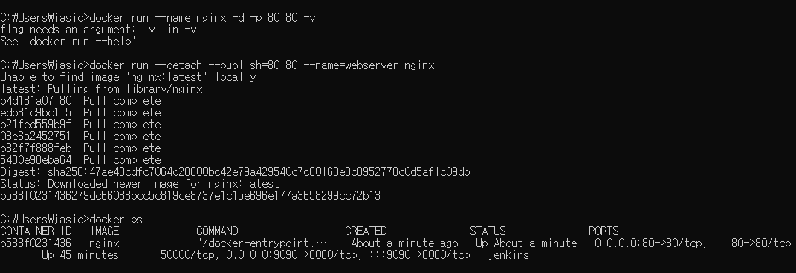
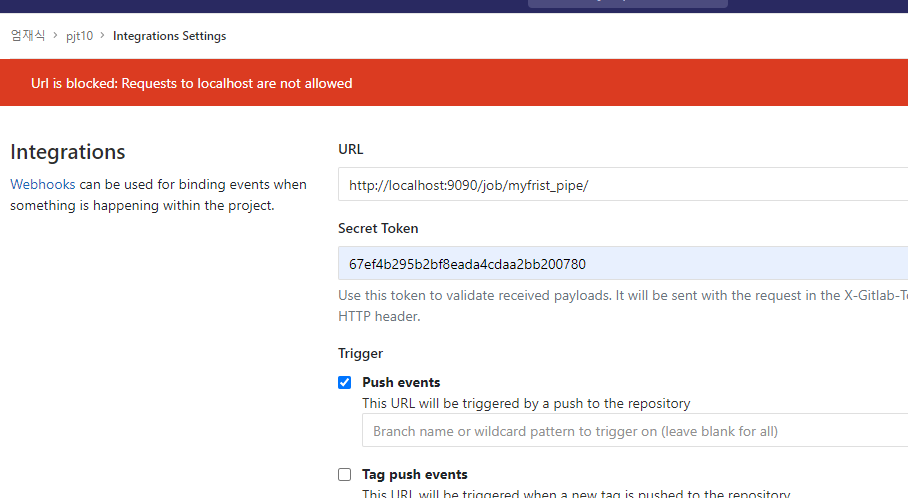

# 산출물
-
-

- CI/CD - 지속적 배포
- 이를 위한 툴로 Jenkins를 Docker로 설치해보자

> - Docker 설치 - del, F1, F2 키로 BIOS 진입하여 Advanced CPU세팅에서 SVM mode ON
> - `docker run -d -u root -p 9090:8080 --name=jenkins jenkins/jenkins` 로 jenkins 설치
> - http://http://localhost:9090/ 에 접속하여 비밀번호 입력
>   비밀번호 확인 `docker logs jenkins`

- Jenkins와 GitLab연동

> - 토큰 발행 및 Plugin 설치
>
> Gitlab: repository에서 settings - access token 발행
>
> Jenkins: plugin 설치는 Jenkins관리에서 available Tab - nodejs, BlueOcean, Gitlab 관련 모두 설치
>
> - 연동 (configure System Tab)
>
> system configure 에서 GitLab 항목에 입력.
> url: https://lab.ssafy.com,
> credentials을 추가, kind 설정하고 Token과 User ID로 연결

`docker run --name nginx -d -p 80:80 -v c:/Users/jasic/dist:/usr/share/nginx/html nginx` 
한줄에 치는건지 모르고 계속 해멨다. 명령어를 이해하지 못해 발생했던 문제..

doker ps : 실행중인 컨테이너
doker ps -a : 정지된 컨테이너
doker rm [name] : 컨테이너 삭제
doker start [name] : **name에는 ID 또는 name이 들어갈수 있다.**
doker stop [name]

> - 이제 진짜 연동! (Pipeline)
>
> views 에서 pipeline 생성
> gitlab Tab에서 Build trigger 설정한 후 Sceret Token 생성.
>
> 해당 프로젝트의 settings - Integrations

URL에서 에러가 발생: Item url을 제대로 가져오지 못하여 생긴 오류같다.

