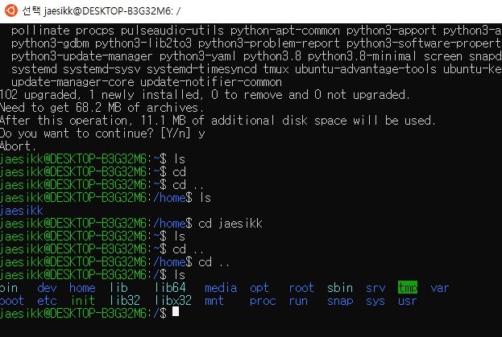

# 산출물
- WSL2

### :bulb: WSL2를 수동설치하였습니다.

> 0. Powershell을 관리자권환으로 실행
>
> 1. Linux용 Windows 하위 시스템 사용
>
> ```powershell
> > dism.exe /online /enable-feature /featurename:Microsoft-Windows-Subsystem-Linux /all /norestar
> 
> - 
> ```
>
> 2. Virtual Machine 기능 사용
>
> ```powershell
> dism.exe /online /enable-feature /featurename:VirtualMachinePlatform /all /norestart
> ```
>
> 3. Linux 커널 업데이트 - msi 파일 설치
> 4. WSL2를 기본 버전으로 설정
>
> ```powershell
> wsl --set-default-version 2
> ```

> **Ubuntu 설치 (Linux 배포)**
>
> Linux 관리자 (superuser) 계정 만들기
>
> ```bash
> sudo apt update && sudo apt upgrade
> ```
>
> 

- 진행하면서 알게된 점

리눅스 OS는 오픈소스로 무료이고, 윈도우보다 메모리 관리를 비롯하여 서버가 굉장히 안정적이다.
또한, 다양한 개발자들이 원격으로 제어할 수 있다는 장점하에 윈도우보다 리눅스를 사용한다는 것을 알게 되었다.


> - 진행하면서 겪은 문제와 해결방안
>
> 
>
> 리눅스, 배포판의 의미
>
> GUI, CLI 쉘 인터페이스
>
> 우분투
>
> 리눅스 머신을 구할 수 있는 방법