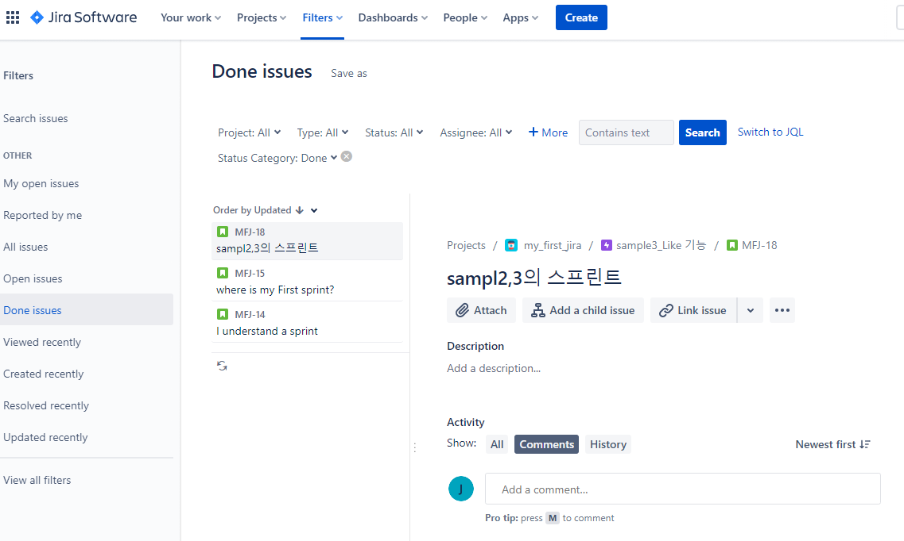
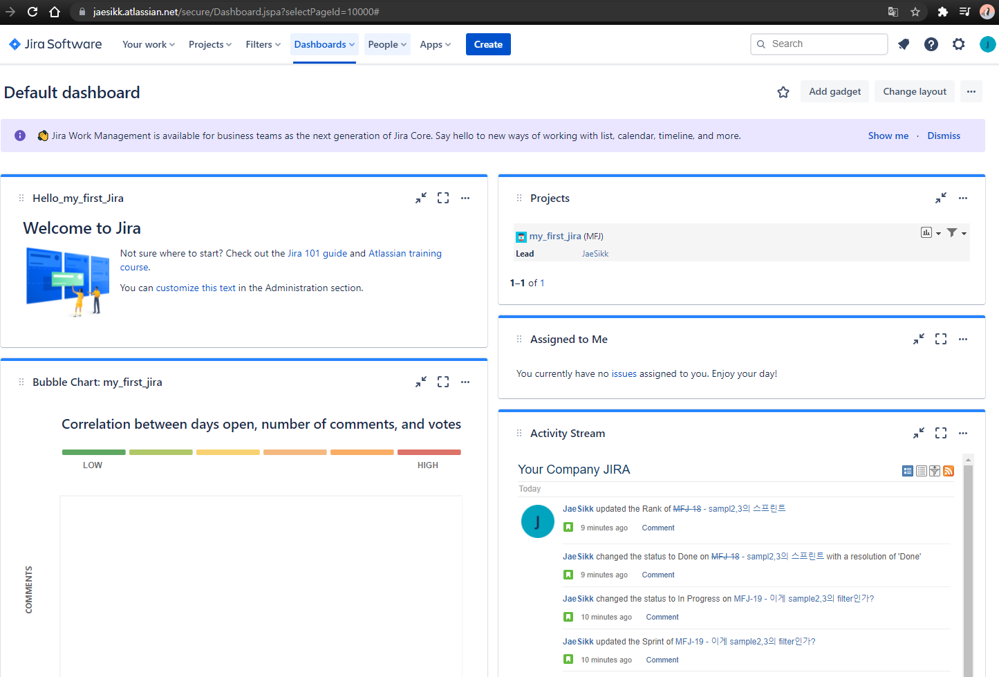

# 산출물

JIRA Project url : https://jaesikk.atlassian.net/jira/software/projects/MFJ/boards/1

Filter url : https://jaesikk.atlassian.net/browse/MFJ-18?filter=-9

Dashboard url : https://jaesikk.atlassian.net/secure/Dashboard.jspa?selectPageId=10000

## :computer: Filter 결과물

Filter 사용에 대해 더 알아보기.

## :computer: Board 결과물

# :notebook: JIRA

> **:baby_bottle: 백로그**
>
> 전체적으로 해야하는 일들
> 모든 이슈티켓이 들어오는 곳.
> 스프린트도 들어올 수 있다.

> **:baby_bottle: Active sprint**
>
> 해야하는 일들을 기간별로 나눠놓은.
> 일의 싸이클.
> 몇주 단위로 해야하는 일.
> 여기서 이슈를 등록을 할때 policy에 따라서 우선순위를 지정한다.

> **:star: Workflow - burndown chart**
>
> TO DO // IN PROGRESS // DONE

> **:snail: Story point**

>**:bulb: JIRA의 장점**
>
>Project Policy - 직무의 우선순위를 정할 수 있다.
>	ex_level) critical, manager, minor, epic
>
>Permission - issue ticket은 팀장이 한다.
>
>Roll & Rule
>	FE, BE이나 각 기능 구현과 같이 분업
>
>Issue Tracking
>	모든 일을 우선순위를 등록해야 잊지 않고 관리할 수 있다.

