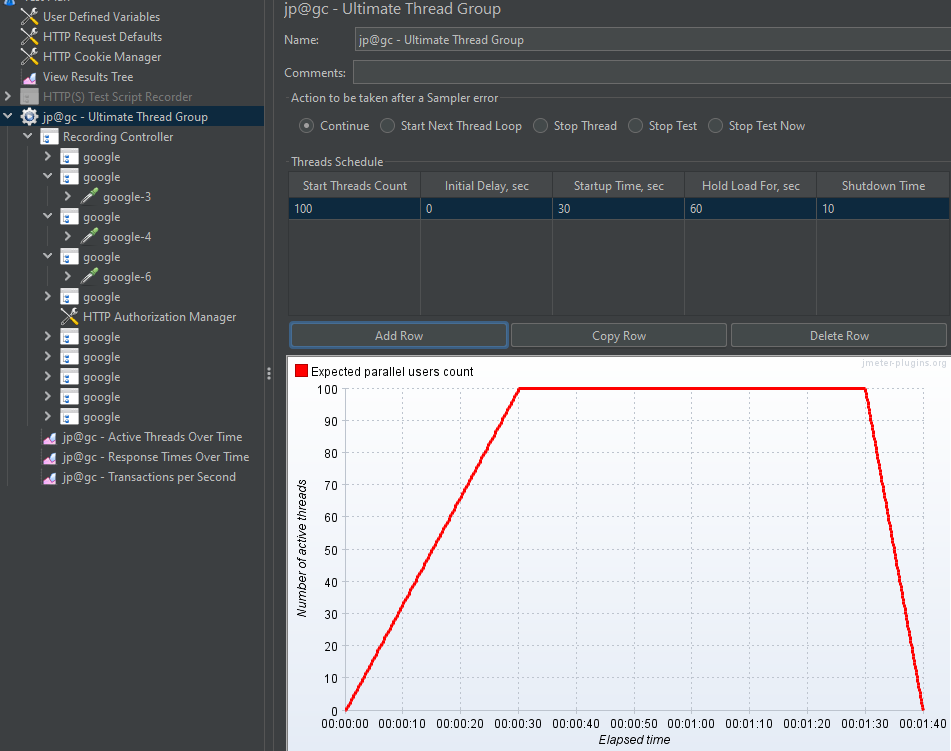
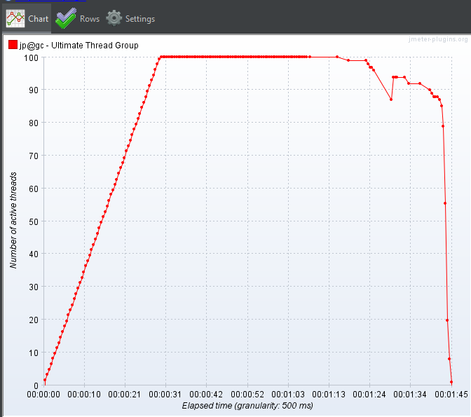
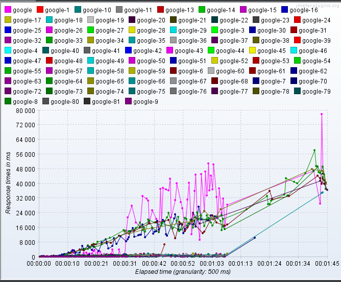
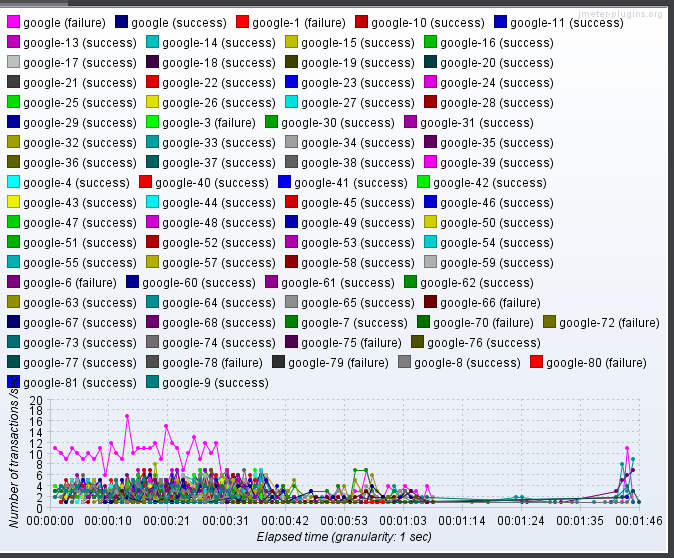

# 산출물

- 대상 시스템의 개략적인 한계 부하(TPS) 측정 결과
  - 한계 부하 당시의 CPU, MEM 점유율(스크린샷)
  - 한계부하 기술

- 한계 부하 발생후의 그래프
  - TPS그래프
  - 응답속도 그래프
  - 유저 쓰레드 그래프 

## 수행

> Templates에서 **recording** 으로 생성
>
> Ultimate Thread Group 생성 **(직관적으로 부하설계를 할 수 있다.)**
> Thread Group에서 Recording Controller를 Ultimate Thread Group에 넣고 Thread Group은 삭제

> 3가지 그래프: ATOT, RTOT, TPS 생성 - (리스너에서 추가)

> HTTP TSR 에서 `start` 클릭 시 인증서 창
> 인증서 등록하고
>
> 프록시 서버에서 기록

play 버튼으로 각 그래프 기록

## :bulb: Active Threads Over Time

## :bulb: Response Times Over Time

## :bulb: Transactions per Second

