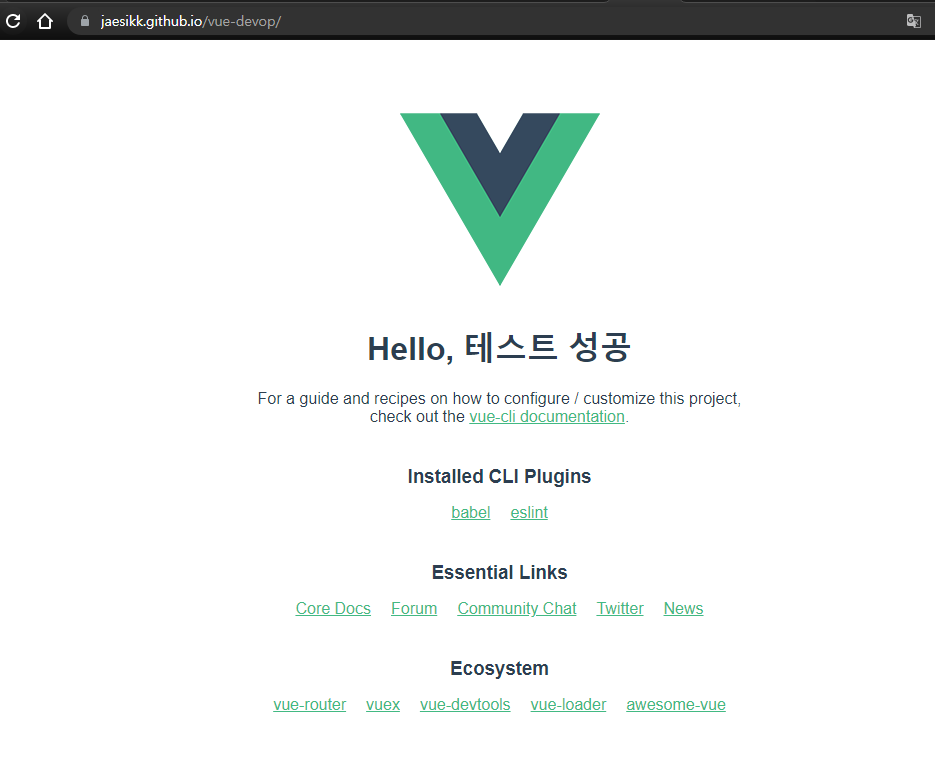

# 산출물
>  vue 프로젝트를 Github을 통해서 수동 배포하는 과정을 해보았다.
> Pages로 배포하기 위해 package.json에 homepage, predeploy, deploy, clean을 부분 추가하였다.
>
> publicPath를 설정하기 위해 vue.config.js를 생성하여 경로를 해당 repository로 설정하였다.
>
> `yarn deploy` 명령을 통해서 gh-pages 브랜치를 생성하여 푸시되며 주소가 배포된다.
>
> Github Actions workflow를 통해 배포를  자동화시켜보았다.
> 배포 스크립트인 workflow 파일(deploy.yml)을 생성 및 수정하여 변경된 파일들을 Stage에 추가하였다.
>
> `yarn test:unit` 커맨드를 이용하여 테스트를 해보았는데 커맨드가 없다는 에러를 받아 문제가 있었다.

- 

- 
- 